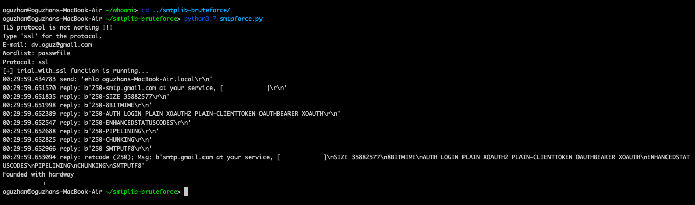

[](https://circleci.com/gh/oguzhanlarca/smtplib-bruteforce/tree/master) [](https://github.com/oguzhanlarca/smtplib-bruteforce)

## Prerequisites & Dependencies
*   Python 3.7.4 64-bit or greater
*   The pip3.7 package management tool or greater

## Installation
```
$ git clone https://github.com/oguzhanlarca/smtplib-bruteforce.git
$ cd smtplib-bruteforce
$ python3.7 smtplib-bruteforce
```

## Prevent Webmail Attacks

Using at least two-factor authentication, such as RSA Security Inc.'s hardware SecurID token. These tokens fit in the palm of your hand, and they display a different password for every login. The password is never repeated, and the odds of guessing it at the right time are extremely small. The user generally also types in a personal PIN, combining the hardware token (something you have) with the PIN (something you know). There are also many other ways to implement two-factor authentication, such as software-based authenticators or cell phone-based systems.

You can also reduce the risk of brute-force webmail attacks by limiting login attempts (i.e. three failed logins in one minute results in a 15-minute lockout). This dramatically limits an attacker's number of guesses. Make sure you have a strong password policy so passwords are difficult to guess, and test accounts regularly. Finally, if you have a password reset system, ensure the answers to questions are not easily attainable from public records or social networking sites.

oguzhanlarca@pm.me
